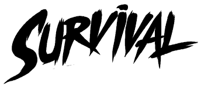
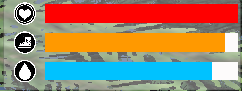
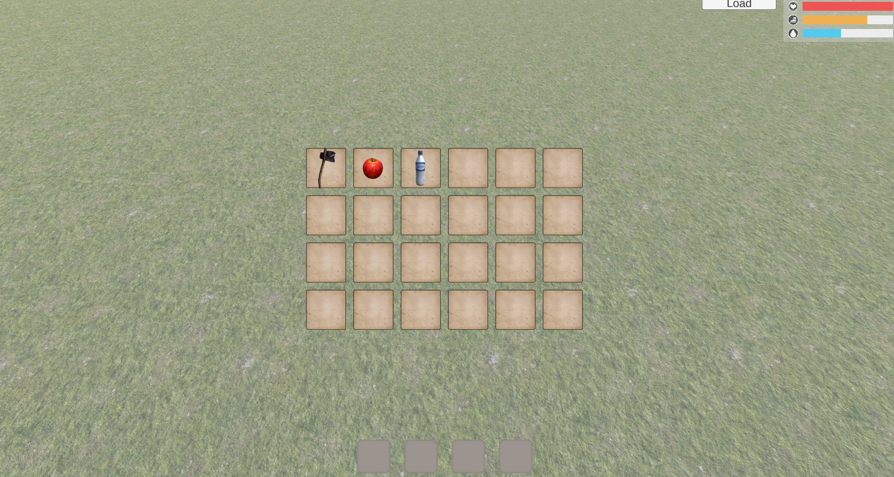
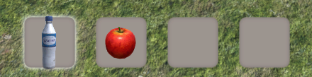
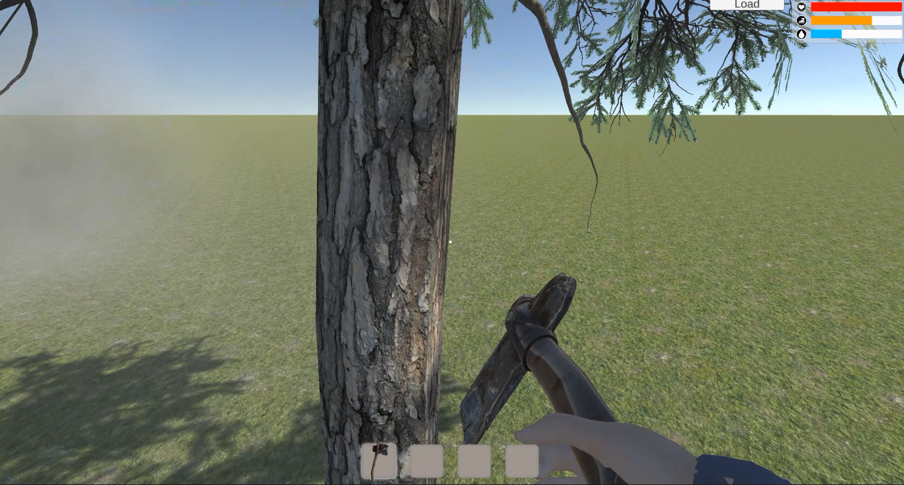

# 3Dsurvival

___
Прототип игры жанра survival
___

## О проекте 

Мой первый 3D проект, в котором для меня было основной целью создать систему инвентаря и крафта.
Инвентарь является важной частью многих игр и для меня было важно освоить принцип его создания.

### При разработке научился: 
+ Создавать скелет персонажа и необходимые анимаций с помощью Mixamo;
+ Интегроровать анимации в движок Unity;
+ Познакомился с основными принципами работы при создании UI интерфейса;
+ Познакомился с основами создания terrain;

___

## Основной геймплей 

+ Cтандартное управление:
  + Перемещение(кнопки WASD, Shift, пробел)
  + Атака (ЛКМ)

+ Индикаторы состояния игрока: 
  + Здоровье:  
  Для пополнения индикатора необходимо подобрать аптечку;

  + Жажда:  
  Для пополнения необходимо выпить воды.Если индикатор опускается до нуля, он начинает влиять на основное здоровье игрока;

  + Голод:  
 Для пополнения необходимо съесть пищу.Если индикатор опускается до нуля, он начинает влиять на основное здоровье игрока;

     

+ Инвентарь: 
  + Все подобранные предметы помещаются в основной инвентарь:  
   
  + Для взаимодейсвия игрока с предметами в инвенаре, необходимо перенести предмет в инвентарь быстрого доступа. 
  +  
  + Нажатием соответсвующей цифры на клавиатуре игрок выбирает необходимый слот инвентаря быстрого доступа.  
  + После чего, нажатием ЛКМ использовать предмет.
  + Предметы можно выбросить переместив их из инвенатаря.

+ Система крафта: 
  + При наличии необходимых ресурсов в инвентаре, можно создавать предметы. 
   
  + На каждый предмет заложено свое время создания. 

+ Добыча ресурсов: 
  + При наличии необходимого оружия, можо добывать ресурсы (С помощью топора добывается дерево и т.д.)
   
   

  
  

___

## Что бы хотел изменить, если бы делал данный проект на сегодняшний день:

+ Проект находится на стадии разработки;